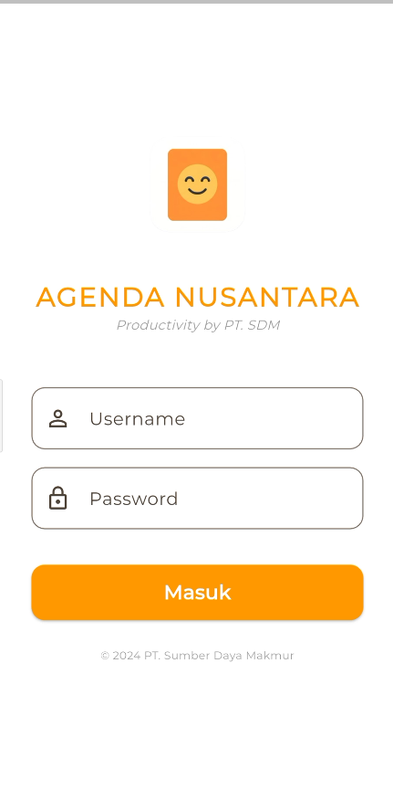
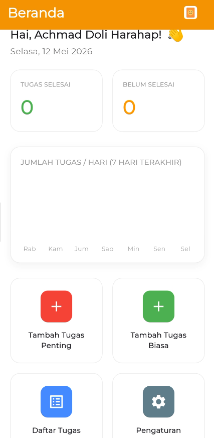
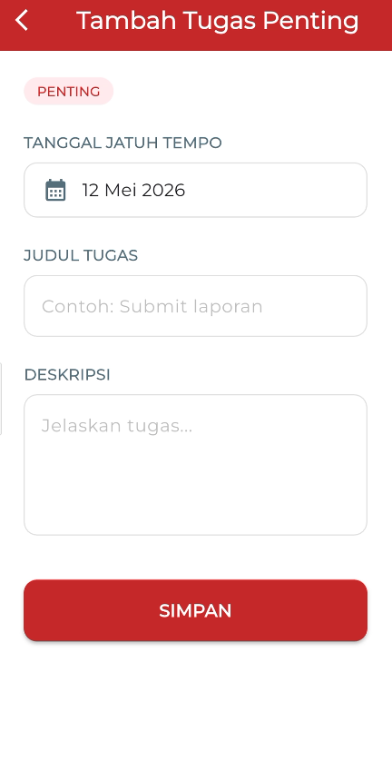
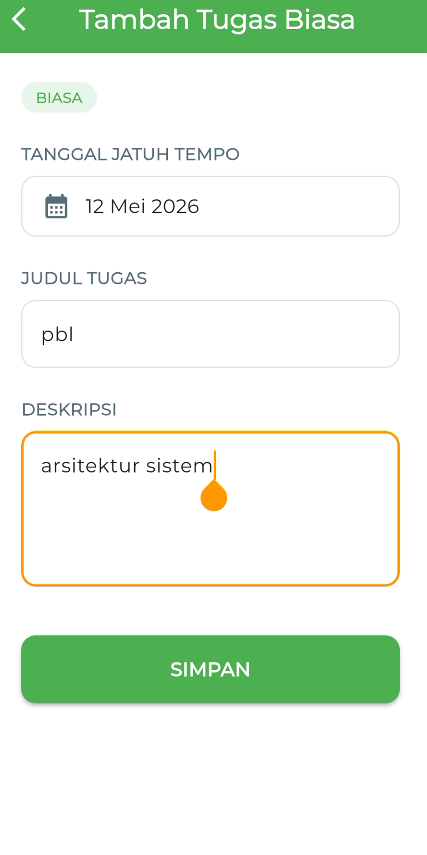
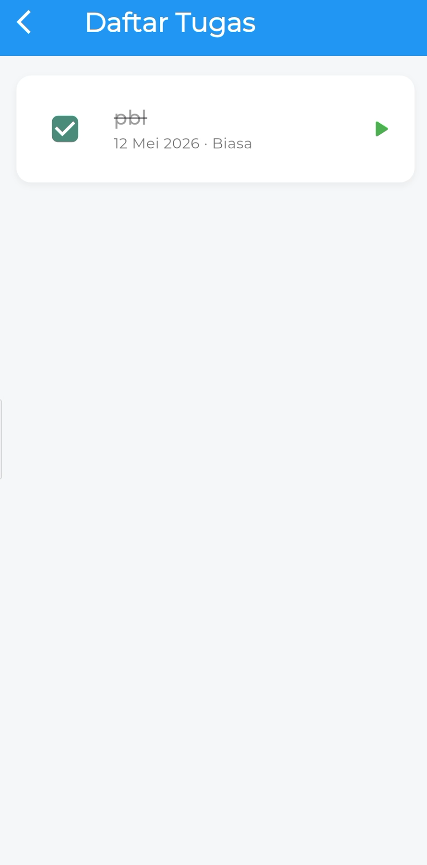
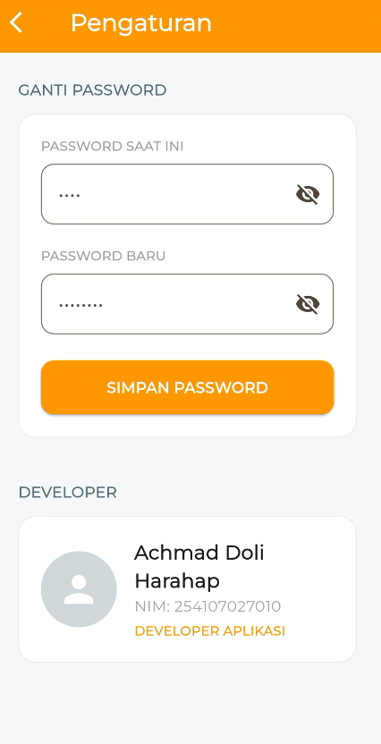

# Agenda Nusantara

Agenda Nusantara adalah aplikasi mobile sederhana berbasis database lokal untuk mencatat, mengelola, dan memantau daftar tugas harian pengguna. Aplikasi ini dibuat sesuai skenario **Soal Tes Observasi SERTIKOM BNSP DIPA 2026** pada skema **Pemrograman Aplikasi Mobile Berbasis Database**.

Aplikasi menyimpan data secara lokal menggunakan **SQLite**, sehingga dapat digunakan tanpa koneksi internet, server, ataupun API eksternal.

---

## Tentang Aplikasi

**Agenda Nusantara** membantu pengguna mengelola todo list berdasarkan dua kategori tugas:

1. **Tugas Penting**
2. **Tugas Biasa**

Setiap tugas memiliki informasi tanggal jatuh tempo, judul, deskripsi, kategori, dan status penyelesaian. Pengguna juga dapat melihat ringkasan jumlah tugas selesai dan belum selesai melalui halaman beranda.

---

## Fitur Utama

- Login menggunakan username dan password.
- Menampilkan ringkasan total tugas selesai dan belum selesai.
- Menambahkan tugas penting.
- Menambahkan tugas biasa.
- Menyimpan data tugas ke database lokal SQLite.
- Menampilkan semua tugas dalam bentuk daftar yang dapat di-scroll.
- Menandai tugas sebagai selesai.
- Membedakan tugas penting dan tugas biasa menggunakan warna indikator.
- Mengganti password melalui halaman pengaturan.
- Menampilkan informasi developer aplikasi.

---

## Tampilan Aplikasi

### 1. Halaman Login

Halaman Login digunakan sebagai pintu masuk ke aplikasi. Pengguna memasukkan username dan password untuk mengakses halaman Beranda.

Fitur pada halaman ini:

- Logo aplikasi.
- Nama aplikasi.
- Input username.
- Input password.
- Tombol login.
- Validasi akun default.

---

### 2. Halaman Beranda

Halaman Beranda menampilkan ringkasan tugas pengguna dan menu navigasi utama.

Fitur pada halaman ini:

- Total tugas selesai.
- Total tugas belum selesai.
- Grafik jumlah tugas selesai per hari.
- Tombol menuju Tambah Tugas Penting.
- Tombol menuju Tambah Tugas Biasa.
- Tombol menuju Daftar Tugas.
- Tombol menuju Pengaturan.

---

### 3. Halaman Tambah Tugas Penting

Halaman ini digunakan untuk menambahkan tugas dengan kategori **Penting**.

Data yang diinput:

- Tanggal jatuh tempo menggunakan date picker.
- Judul tugas.
- Deskripsi tugas.

Ketika tombol **Simpan** ditekan, data akan disimpan ke SQLite sebagai tugas penting.

---

### 4. Halaman Tambah Tugas Biasa

Halaman ini digunakan untuk menambahkan tugas dengan kategori **Biasa**.

Data yang diinput:

- Tanggal jatuh tempo menggunakan date picker.
- Judul tugas.
- Deskripsi tugas.

Ketika tombol **Simpan** ditekan, data akan disimpan ke SQLite sebagai tugas biasa.

---

### 5. Halaman Daftar Tugas

Halaman Daftar Tugas menampilkan seluruh data tugas yang telah disimpan, baik tugas penting maupun tugas biasa.

Fitur pada halaman ini:

- Menampilkan daftar tugas dalam komponen list.
- Daftar dapat di-scroll jika data banyak.
- Menampilkan judul tugas.
- Menampilkan tanggal jatuh tempo.
- Menampilkan kategori tugas.
- Menampilkan indikator warna:
  - Merah untuk tugas penting.
  - Hijau untuk tugas biasa.
- Menandai tugas sebagai selesai melalui klik item atau checkbox.

---

### 6. Halaman Pengaturan

Halaman Pengaturan digunakan untuk mengganti password pengguna.

Fitur pada halaman ini:

- Input password saat ini.
- Input password baru.
- Validasi password saat ini.
- Simpan password baru jika valid.
- Menampilkan foto, nama, dan NIM developer.

---
